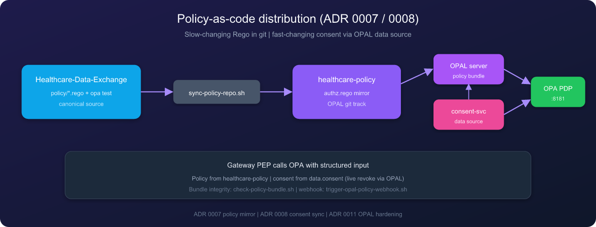

<p align="center">
  
</p>

<h1 align="center">healthcare-policy</h1>

<p align="center">
  <strong>OPAL-tracked policy mirror</strong> for
  <a href="https://github.com/SafetyMP/Healthcare-Data-Exchange">Cloud Healthcare Exchange</a>
</p>

<p align="center">
  <a href="https://github.com/SafetyMP/healthcare-policy/actions/workflows/portfolio-verify.yml"></a>
  <a href="https://github.com/SafetyMP/Healthcare-Data-Exchange"></a>
</p>

---

> **Do not edit Rego here.** Canonical source and OPA tests live in `policy/` on the main repo. Updates arrive via `./scripts/sync-policy-repo.sh` from [Healthcare-Data-Exchange](https://github.com/SafetyMP/Healthcare-Data-Exchange). Not a standalone product — clone Healthcare-Data-Exchange to change policy.

> **Permit rule:** Do not edit policy in the mirror. Canonical Rego lives on Healthcare-Data-Exchange. Same instinct: [SafetyMP](https://github.com/SafetyMP/SafetyMP).

## Architecture

| Policy + OPAL flow | Social preview |
|:------------------:|:--------------:|
|  | Regenerate with `./scripts/render-assets.sh` then upload `docs/assets/social-preview.png` |

See [ADR 0007](https://github.com/SafetyMP/Healthcare-Data-Exchange/blob/main/docs/adr/0007-opal-policy-mirror.md) on the canonical repo.

## Harness

Profile: **policy-mirror** · Portfolio: [`specs/portfolio.yaml`](specs/portfolio.yaml) · Verify: `./scripts/verify.sh`

## OPAL bundle

| Path | Role |
|------|------|
| `authz.rego` | `chex.authz` package; consent from `data.consent` |
| `.manifest` | OPA bundle roots (`chex`) for OPAL |
| `.harness/canonical-pointer` | Last canonical commit + bundle hash |

## Canonical workflow

```bash
# On Healthcare-Data-Exchange (canonical)
./scripts/verify.sh
./scripts/sync-policy-repo.sh   # pushes policy mirror here
```

## Assets

Diagram sources and PNG exports: [`docs/assets/`](docs/assets/README.md)

## License and security

Apache License 2.0. See [`LICENSE`](LICENSE), [`SECURITY.md`](SECURITY.md), [`CONTRIBUTING.md`](CONTRIBUTING.md), and [`CODE_OF_CONDUCT.md`](CODE_OF_CONDUCT.md).
